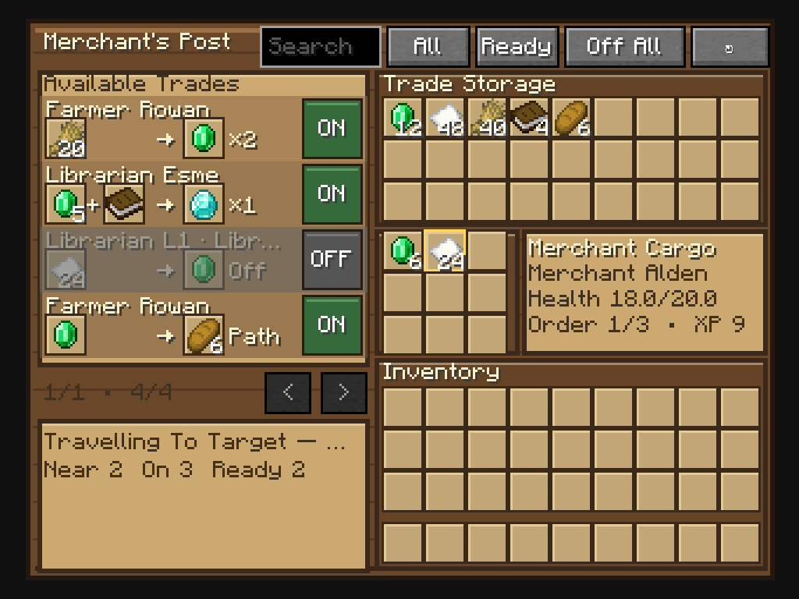
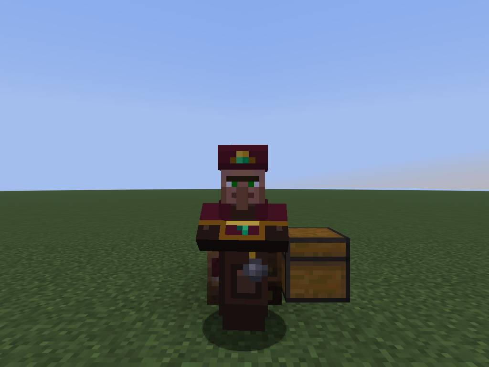

# Merchant Villager

Merchant Villager automates approved trades without replacing villagers with
virtual menus. One physical Merchant Villager operates one Merchant's Post,
visits the real villager or Wandering Trader that owns an offer, performs the
trade, and carries the result back.

The post catalogues offers from real, currently loaded merchants in range.
Every newly discovered offer starts disabled until a player explicitly enables
it.

## Requirements

- Minecraft: Java Edition 1.21.11
- Fabric Loader 0.19.3 or newer
- Fabric API 0.141.6+1.21.11 or newer
- Java 21
- The mod and Fabric API installed on the server and every joining client

For single-player, install both Merchant Villager and Fabric API in the
instance's `mods` folder. For multiplayer, install the same compatible mod
version on the dedicated server and on each client.

## Screenshots





## Gameplay

Craft a Merchant's Post from a barrel, bell, and emerald, place it near an
unemployed adult villager, and place a chest directly against any face of the
post. Open the post (or interact with its assigned Merchant) to approve offers
and insert matching trade materials into the shared 27-slot inventory.

Only a chest block that shares a face with the post is accepted. Diagonal
chests, chests separated by a gap, and unrelated nearby player storage are
ignored. A connected double chest works when at least one half shares a face
with the post.

The catalogue supports text search, readiness/permission/stock/profession
filters, multiple sort orders, click-anywhere trade toggles, clear gray disabled
rows, and a server-authoritative Disable All action. The right side presents
the post's 27-slot Merchant Backpack, the player's inventory, live worker
details, and all nine read-only in-transit cargo slots. Ghost inputs provide
convenient deposits: left-click moves the matching cursor stack, right-click
moves one, and shift-click moves all matching stacks from the player inventory.

The server moves an exact trade batch into the Merchant's nine cargo slots.
The Merchant walks to the real target, performs that target's real offer at
interaction distance, returns to the post, and deposits the rewards into the
touching chest.
Several approved offers at one target can share the same physical visit.
Hover the live status line for worker health, distance, cargo, work-order
progress, current target, output chest, and last-failure details.

Targets through 55 blocks are normal. Targets farther than 55 and no farther
than 66 blocks must make measurable progress toward the post during a 20-tick
observation window. The Merchant never intentionally exceeds the 66-block
tether.

## Storage safety and recovery

The Merchant never searches arbitrary storage around the post. If no touching
chest can accept the expected rewards, work waits instead of selecting another
nearby chest. Keep free space in the touching chest before enabling large
batches.

On an unload or restart, serialized in-flight cargo is conservatively routed
through recovery rather than blindly reissuing an uncertain offer use. Inputs
return to the post; rewards remain reward cargo until a valid chest accepts
them.

## Operator commands

`/merchant_villager inspect [pos]`

`/merchant_villager refresh [pos]`

`/merchant_villager pause [pos]`

`/merchant_villager resume [pos]`

`/merchant_villager release [pos]`

Without `pos`, the command uses the post the operator is looking at.

## Source, issues, and license

- Source: https://github.com/FluffyBacon678/Minecraft-VillagerMerchant-Mod
- Issues: https://github.com/FluffyBacon678/Minecraft-VillagerMerchant-Mod/issues
- License: [CC0 1.0 Universal](LICENSE)

## Development

Use Java 21:

```text
gradlew build
gradlew test
gradlew runGameTest
gradlew runClientGameTest
gradlew runDatagen
gradlew runServer
gradlew runClient
```

Every push and pull request also runs the build, unit tests, server-side Fabric
GameTests, and the real non-origin Merchant Post client-screen test
through GitHub Actions. The client job uploads its GUI screenshot as an
artifact.

See [ARCHITECTURE.md](ARCHITECTURE.md) for persistence, networking, AI, cargo,
reservation, and recovery design.
